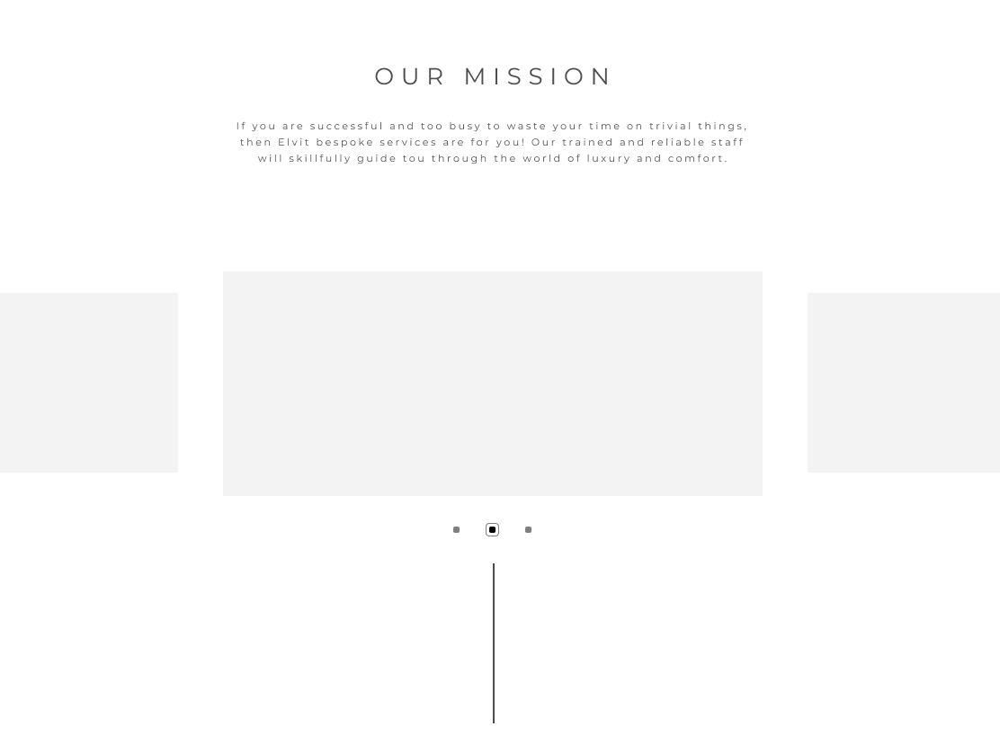

### Environment, IDE, Tech stacks, Public resources
- NodeJS 12.20.0
- VSCode
- React, tailwindcss
- dev.to

### Steps
One day when I was busy living, I got a message from one of my very best friends, she says, can you do me a favor design a landing page like this? After confirmed it's a paid job, I turned into working mode, the design looks like this:

<!--  -->

What an awesome design, but wait, I've never actually written a responsive landing page, where should I start?

At first, I searched on the Internet for open source examples using tailwindcss, and I found this, by just key words "tailwind responsive" at [dev.to](https://dev.to)

Then I found this [example](https://w3hubs.com/Responsive-Footer-Using-Tailwindcss/) on the first page of search results.

Now time to do some deconstruction and reconstruction.

Here we go:
- The extra styles for responsive page is simple
```css
@media(max-width: 642px){
  .w-full,.bottom{
  text-align: center;
  }
  .pl-8{
  padding-left: 0px;
  }
}
```

Which simply means on mobile devices, put text on the middle and remove some paddings or maybe margins.


- This code snippet defines a responsive structure like this
```html
<div class="flex flex-wrap justify-center bg-purple-800 p-6">
  <div class="flex flex-wrap mb-4 w-full">
  ...
  </div>
</div>
```

But hey we can make it simpler by removing "flex-wrap" in the outer div, since it only has one child, and here we get a pretty clean version of this structure
```html
<div class="flex justify-center">
  <div class="flex flex-wrap">

  </div>
</div>
```
Reason of keeping "flex-wrap" in the inner div is to allow elements wrap on mobile devices, and "w-full" is not actually needed because in this example, each element will have its own width in percentage
```html
<div class="w-full sm:w-1/2 md:w-1/2 lg:w-1/4">
...
</div>
```
Here is the declaration of a single block, for its size to be responsive, four types of size are defined, and it changes at some specific points. It is definitely the only way of design a responsive grid view, but if the grids in the application do not have any minimum width bottom line, while still needs to change responsively, this is a good practise.

And that's it, if you look into the content, you will find it's just nothing more than raw elements like ul, form, button, input, all the width are controlled by their parents.

If I just leave the code snippets as takeaways, they are hard to remember as well as utilize. But thanks to React, with components, the page can be written like this
```html
<Wrapper>
  <Component1224></Component1224>
  <Component1224></Component1224>
</Wrapper>
```

You can build other responsible components in this way
```html
<VerticalWrapper>
  {/*This means, do not show in mobile devices*/}
  <Component0011></Component0011>
</VerticalWrapper>
```
In conclusion, the principles I got from building a responsive website until now are:
- Using pre-defined page structure
- Control custom styles inside child components(which means "```<Wrapper style="XXX">```" is a bad idea)

### Problems I ran into
- z-index property is not inherited, just zindex value of the children is upper bounded by their parent, so in some situations, u need to set z index for all children
- It's hard to add 3d transform into elements with fixed background
- Swiper API for React is hard to use, just use "useRef" and Swiper API as a third-party library


