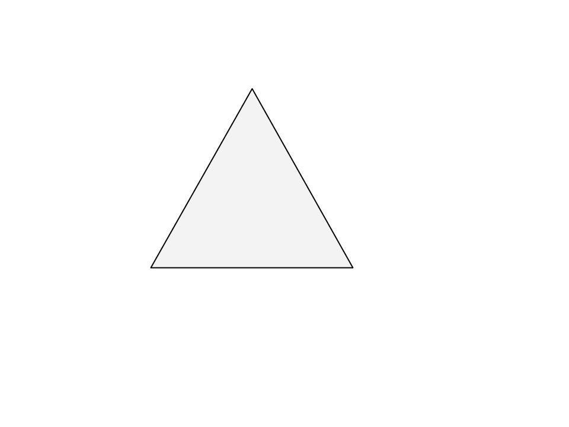
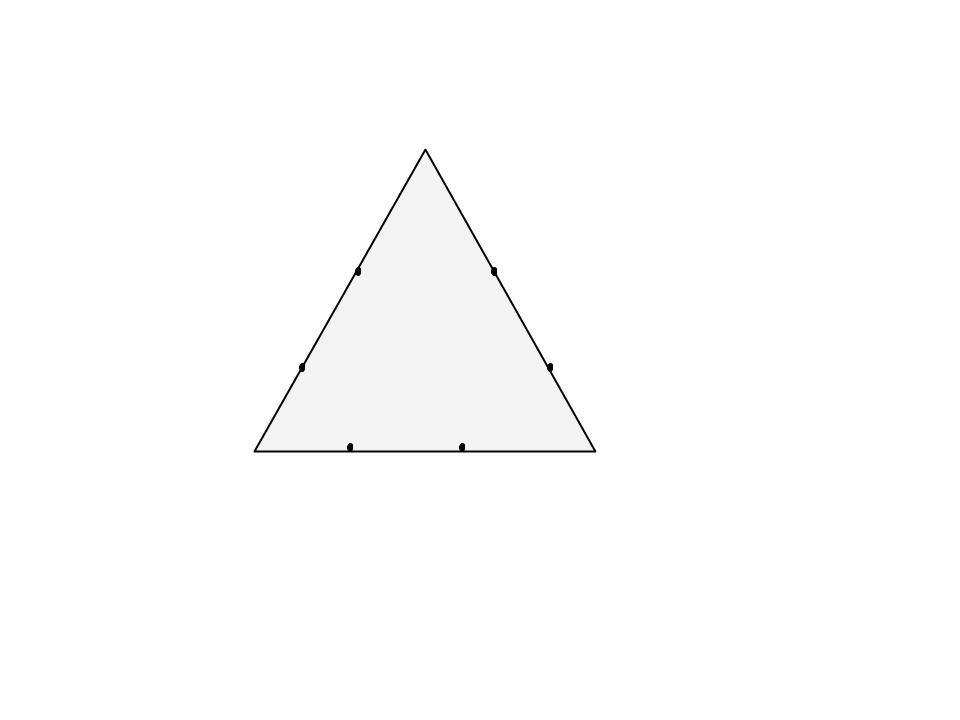
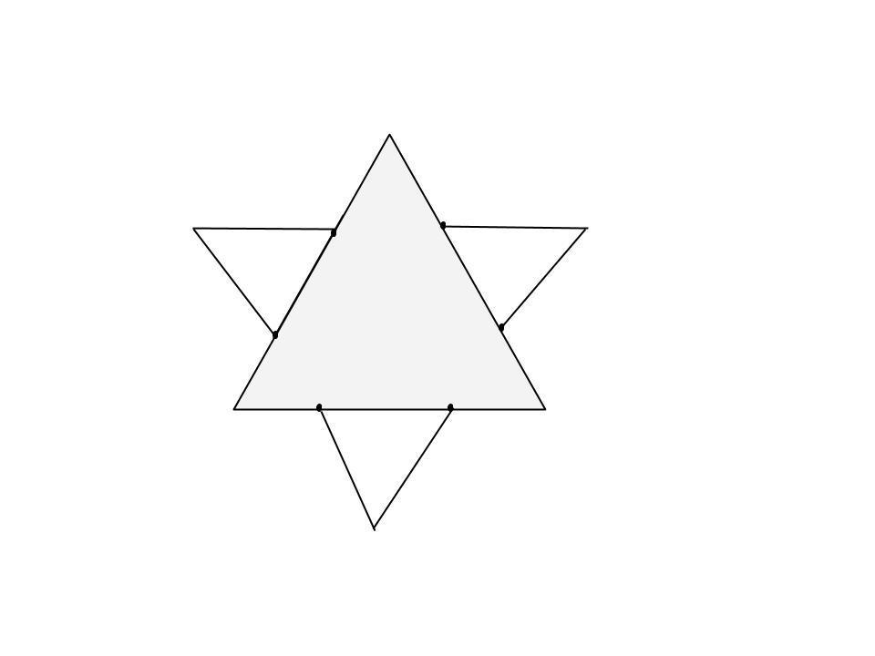
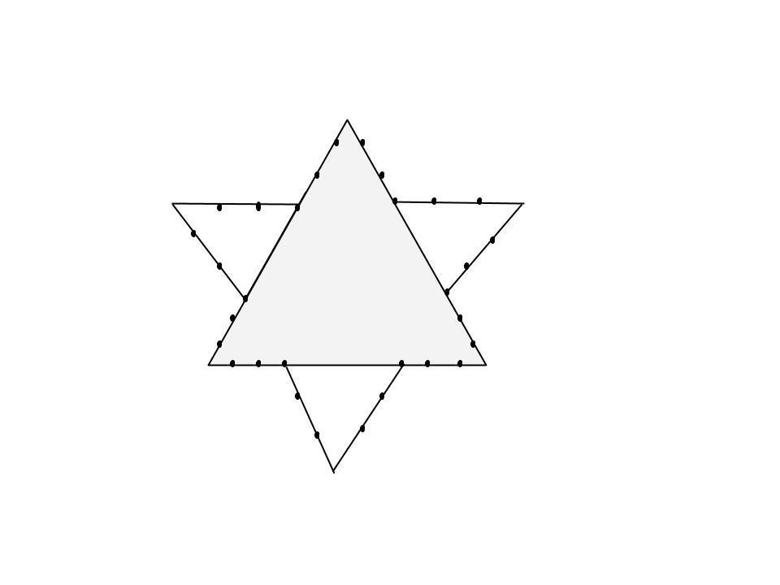
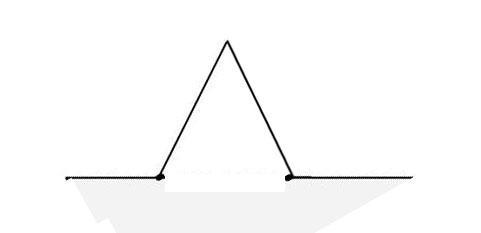
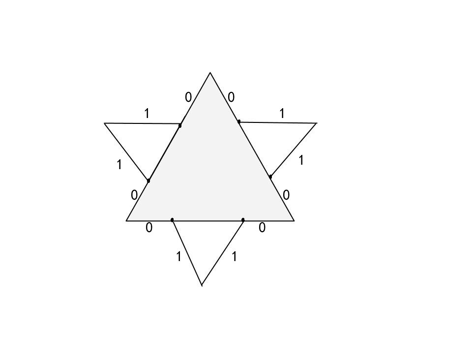

Koch Curve（Koch Snowflake）
https://www.geeksforgeeks.org/koch-curve-koch-snowflake/

简介：

科赫雪花（科赫曲线）是最早发现的分形曲线之一，由瑞典科学家 Helge von Koch 在论文中构造

科赫雪花的面积趋向于原始三角形的8/5，而周长趋向无穷大

构造过程：






...

科赫雪花可一通过下列规则描述
[rewrite system](https://en.wikipedia.org/wiki/Rewriting) ([Lindenmayer system](https://en.wikipedia.org/wiki/Lindenmayer_system)):
**Alphabet** : F
**Constants** : +, ?
**Axiom **: F
**Production rules**: F ? F+F–F+F

程序实现

思路1：
首先我们把三条边分开处理
考虑深度为0的情况，显然这条边是一条直线
考虑深度为1的情况，轨迹如下：


我们把这个轨迹抽象为“前进”方法，我们就有变成了深度为1的前进方法 = 深度为0的前进方法 x4 
同理我们发现，深度为2的前进方法 = 深度为1的前进方法 x4
观察到问题的复杂度在不断降低，可以使用递归来处理这样的规律

```python
from turtle import *
def snowflake(lengthSide, levels): 
    if levels == 0: 
        forward(lengthSide) 
        return
    lengthSide /= 3.0
    snowflake(lengthSide, levels-1) 
    left(60) 
    snowflake(lengthSide, levels-1) 
    right(120) 
    snowflake(lengthSide, levels-1) 
    left(60) 
    snowflake(lengthSide, levels-1) 

# main function 
if __name__ == "__main__": 
    speed(0)                    
    length = 300.0          

    #分别处理三条边
    for i in range(3):     
        snowflake(length, 4) 
        right(120) 
    exitonclick()     
```


思路2
把第0层画的线用0表示，第1层用1表示，那么根据画笔的轨迹我们有
第0层（三角形） 000
第1层                   011001100110
第2层                   022012211221022002201221122102200220122112210220


显然，把上一层的节点复制一遍，中间插入两个当前层次的节点即可。连续相同节点逆时针转120度，非连续相同节点逆时针转60度
```python
from turtle import *
def draw(len,target):
    tasks="000"
    step,depth = len/(3**target),0
    while depth<target:
        depth+=1
        tasks = ''.join([s+str(depth)*2+s for s in tasks])
    pre=''
    for task in tasks:
        if pre==task:
            right(120)
        else:
            left(60)
        forward(step)
        pre = task

length = 300.0
draw(length,3)
```